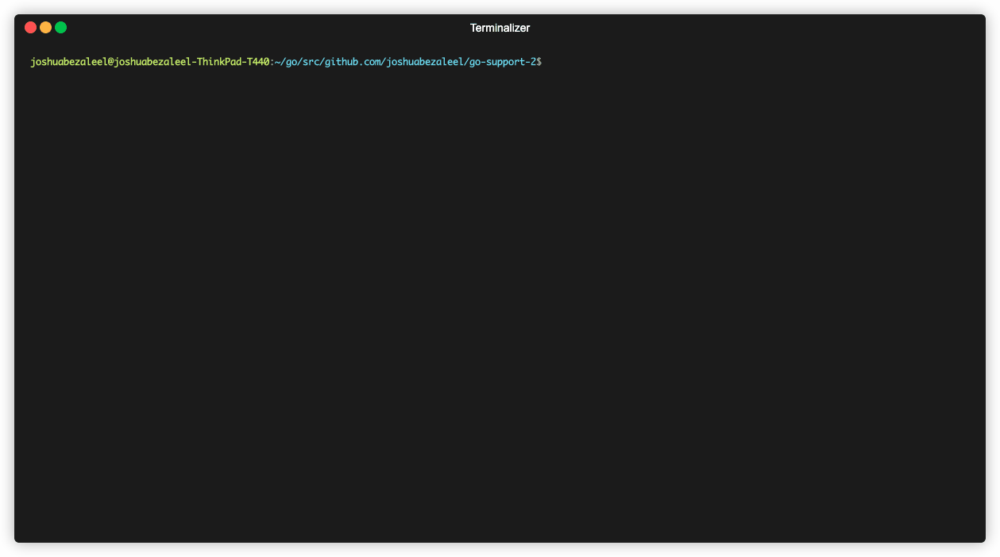

change readme for gh testing

# go-support
Go program for finding and supporting sponsorable awesome Go packages in your project's module dependencies (go.mod).
Let's support all the Go developers and make the Go ecosystem a better place!

## Installation
1. Make sure Go 1.12 or above (that comes with the module support) is installed in your machine.
2. Get the program using `go get github.com/joshuabezaleel/go-support`.
3. Add GitHub token by using the command `export GITHUB_TOKEN="<your_token>"` available at [this link](https://github.com/settings/tokens) to authenticate the request and pass the API rate limit.
4. Run `go-support` in the root of your project modules.
5. Open the URLs in the browser and make donations!

## How it works
- All of the modules and dependencies are retrieved from your project's `go.mod` file. 
- Modules and dependencies that will be processed are the one hosted at GitHub (github.com). 
- The modules are then grouped by author according to the first (1st) GitHub Sponsors-enabled username at the repository's `.github/FUNDING.yml`.
- If no GitHub Sponsors page found at a module, the author name will be parsed from the repository's name.
- All of the funding platforms will be retrieved from each of the repository's `.github/FUNDING.yml`
- URLs that will be opened in the browser are the GitHub authors page stated in the previous point.

## Prior Art
This project is highly inspired by the kind efforts of [feross'](https://github.com/feross) [thanks](https://github.com/feross/thanks), GitHub sponsor, and [npm fund](https://github.com/npm/cli/pull/273). Thank you very much for taking the first steps. 

## LICENSE
Project is licensed under the terms of MIT license. 
